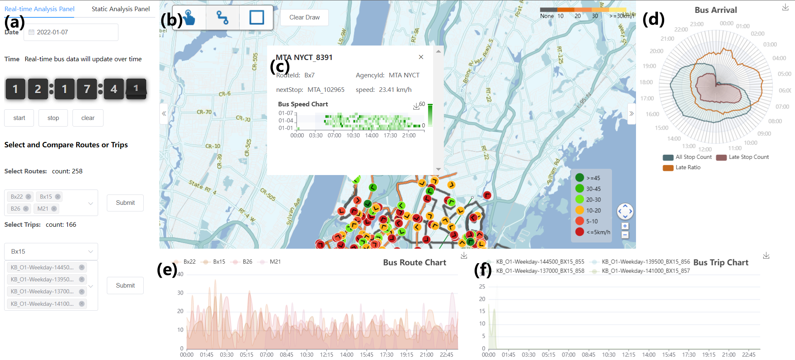

# transitnet-vue
A front-end of transit network visualization platform provides multi-view interactive visualizations for in-depth exploration and mining of public transportation data.
## Getting started
> Make sure Node is downloaded.
### Git clone
Clone the front-end project to local
```
git clone https://github.com/GuYith/transitnet-vue.git
```
### Install dependencies
Enter the root directory of the front-end project, and enter the following command.
```
npm install
```
### Run back-end
1. Modify the back-end url and port based on your requirements.
2. Run the backend project in IntelliJ IDEA and ensure the project runs successfully.
### start
```
npm run serve
```
Open the http://localhost:8085


